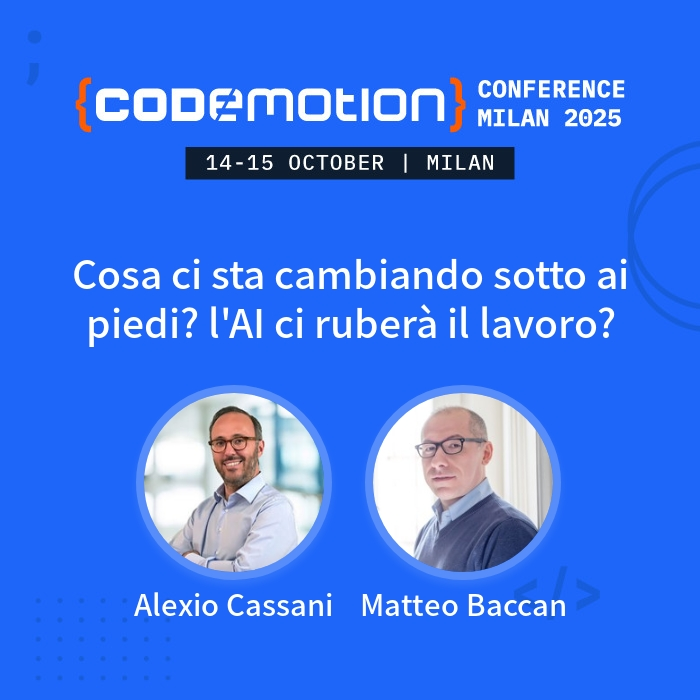

# Codemotion2025

Cosa ci sta cambiando sotto ai piedi? L'AI ci ruberà il lavoro?

Link al post di annuncio su LinkedIn:

https://www.linkedin.com/posts/matteobaccan_codemotion-magazine-codemotion-activity-7378843428878553088-O5BO/

## #CodemotionMilan 2025: cosa mi è rimasto

Se c'è un posto nel mio cuore è quello dedicato a #Codemotion

Nella mia testa è come un bambino che ho visto crescere, quando prima di nascere si stava scegliendo ancora il nome, al quale ho sorriso quando ancora non sapeva cosa voleva diventare, che ho preso in braccio per dare il primo biberon, che ho sorretto quando inciampava nei suoi primi passi e ora è un ragazzo pieno di gioia che corre felice per il mondo.

Ogni volta è sempre un piacere andarci e ancora di più parlare davanti a un pubblico: non importa se piccolo o grande, se il tuo pensiero viene condiviso e permette di far crescere anche una sola persona, allora il tuo pensiero è stato importante.

Voglio ringraziare per prima Mara Marzocchi che mi motiva sempre e che credo abbia una immagine di me molto più grande di quella che ho io.

Non posso dimenticare Arnaldo Morena e Luca Fregoso che hanno coinvolto me e Alexio Cassani (ti ho rubato delle foto: spero non ti arrabbierai) su tema AI e di quanto potrebbe cambiarci il lavoro, ma da ottimista non posso che pensare che non potrà che migliorarlo.

E ringrazio chi ha contribuito, con le sue foto, a poter chiudere il progetto GitHub dell'intervento con qualcosa di più tangibile che delle semplici slide: grazie Umberto Mangiardi di Euroged che col suo post mi ha fatto capire di quanto, quel poco che faccio, possa essere apprezzato da altre persone e grazie per le foto.

E vorrei terminare il mio intervento con una riflessione:

più passerà il tempo e più l'AI correrà veloce e come programmatori ci sentiremo l'anello debole della catena, ma come dice Stanisław Jerzy Lec:

"L'anello più debole della catena è anche il più forte perché può romperla."

## Banner dell'intervento

### Banner principale

Il banner ufficiale dell'intervento "Cosa ci sta cambiando sotto ai piedi? L'AI ci ruberà il lavoro?" presentato da Alexio Cassani e Matteo Baccan al Codemotion Milan 2025.

### Varianti stilistiche

Di seguito le versioni rielaborate del banner originale in diversi stili artistici:

- [`Banner stile Cartoon`](banner/cosa-ci-sta-cambiando-sotto-ai-piedi-lai-ci-rube_cassani-baccan_1036091_banner_carton.png) — Versione cartoon del banner principale
- [`Banner stile Dragon Ball`](banner/cosa-ci-sta-cambiando-sotto-ai-piedi-lai-ci-rube_cassani-baccan_1036091_banner_dragonball.png) — Versione ispirata allo stile Dragon Ball
- [`Banner stile Fine '800`](banner/cosa-ci-sta-cambiando-sotto-ai-piedi-lai-ci-rube_cassani-baccan_1036091_banner_fine800.png) — Versione in stile pittorico di fine Ottocento
- [`Banner stile Simpson`](banner/cosa-ci-sta-cambiando-sotto-ai-piedi-lai-ci-rube_cassani-baccan_1036091_banner_simpson.png) — Versione ispirata allo stile dei Simpson
- [`Banner stile South Park`](banner/cosa-ci-sta-cambiando-sotto-ai-piedi-lai-ci-rube_cassani-baccan_1036091_banner_southpark.png) — Versione ispirata allo stile di South Park
